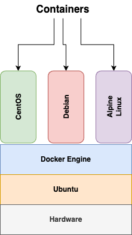

# docker-learn

## Tutorials
Video I watched to learn about k8s: [YouTube](https://youtu.be/eGz9DS-aIeY?si=MiUADLNeIvVApov2)

## Example
1. $ docker pull centos
2. $ docker run -d -t --name myfirstcontainer centos
3. $ docker ps
4. $ docker exec -it myfirstcontainer bash

## Docker common commands

To build an image
- docker build .
OR
- docker build -t <tag_name> .

List Docker images
- docker images

List Docker containers
- docker ps

List Docker containers even stopped
- docker ps -a

Create a container from an image
- docker run -d -p 80:80 --name <name_container> <image_name/image_id>

Exec/remote into a running container
- docker exec -it <name_container> <shell>

Stop a container
- docker stop <name_container>

Start a container
- docker start <name_container>

Remove a container
- docker rm <name_container>

Remove an image
- docker rmi <image_name/image_id>

